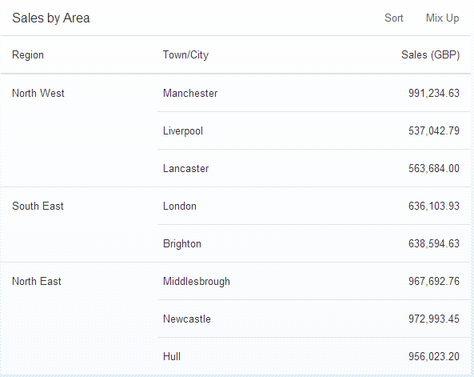

| loio |
| -----|
| 4c98cf1b07754d22bed8b6fba68f2031 |

<div id="loio">

view on: [help.sap.com](https://help.sap.com/viewer/DRAFT/3237636b137e43519a20ad5513c49ccb/latest/en-US/4c98cf1b07754d22bed8b6fba68f2031.html) | [demo kit nightly build](https://openui5nightly.hana.ondemand.com/#/topic/4c98cf1b07754d22bed8b6fba68f2031) | [demo kit latest release](https://openui5.hana.ondemand.com/#/topic/4c98cf1b07754d22bed8b6fba68f2031)</div>
<!-- loio4c98cf1b07754d22bed8b6fba68f2031 -->

## Grouping in a Table

When you have repeated values in your table, you can use `mergeDuplicate` of the `sap.m.Column` control to sort your data based on the column to be merged.

There are two properties related to merging duplicate values:

-   `mergeDuplicates`: set this to true if you want duplicate values for the given column to be merged
-   `mergeFunctionName`: use this to specify the name of the getter function of the control in the column

Duplicate values will only be merged if they are contiguous. That means that you probably want to sort your data first before binding it.

Here's a simple example of using `mergeDuplicates`. We'll set up a table of sales data, and display the data in a table, merging any duplicate regions. When the *Mix Up* button is pressed to lightly shuffle the salesFigures array of objects, you will see that only adjacent duplicates are merged. Press the *Sort* button again to see the ideal merging.

```lang-js
// Sales Areas
var oAreas = {
    "North West": ["Manchester", "Liverpool", "Lancaster"],
    "South East": ["London", "Brighton"],
    "North East": ["Middlesbrough", "Newcastle", "Hull"]
};
    
// Generate some sales figures into a flat array of region/town/amount objects
var oSalesFigures = [];
oSalesFigures = oSalesFigures.concat.apply(oSalesFigures, Object.keys(oAreas).map(function(region) {
    return oAreas[region].map(function(town) { 
        return { "region": region, "town": town, "amount": (Math.random()*1000000+1).toFixed(2) };
    });
}));

var oModel = new sap.ui.model.json.JSONModel({ "sales": oSalesFigures });
sap.ui.getCore().setModel(oModel);
    
var oTable = new sap.m.Table("salesdata", {
     inset: true,
     headerText: "Sales by Area",
     headerContent: [
        new sap.m.Button({
            text: "Sort",
            press: function() {
                var oData = oModel.getData();
                oData.sales.sort(function(a, b) {
                    if (a.region === b.region) return 0;
                    return a.region > b.region ? 1 : -1;
                });
                oModel.setData(oData);
            }
        }),
        new sap.m.Button({
            text: "Mix Up",
            press: function() {
                var oData = oModel.getData();
                oData.sales.sort(function() { return Math.random()-0.5; });
                oModel.setData(oData);
            }
        })
    ],
    columns: [
        new sap.m.Column({
            header: new sap.m.Label({ text: "Region" }),
            mergeDuplicates: true
        }),
        new sap.m.Column({ header: new sap.m.Label({ text: "Town/City" }) }),
        new sap.m.Column({
           header: new sap.m.Label({ text: "Sales (GBP)" }),
            hAlign: "End",
            minScreenWidth: sap.m.ScreenSize.Tablet,
            demandPopin: true,
            popinDisplay: "Block"
        }),
    ],
});

oTable.bindAggregation("items", {
    path: "/sales",
    template: new sap.m.ColumnListItem({
        cells: [
                new sap.m.Label({ text: "{region}" }),
                new sap.m.Label({ text: "{town}" }),
                new sap.m.Label({
                    text: {
                        path: "amount",
                        type: new sap.ui.model.type.Float({ minFractionDigits: 2, maxFractionDigits: 2 })
                    }
                })
        ]
    })
});
    
oTable.placeAt("content");

```



