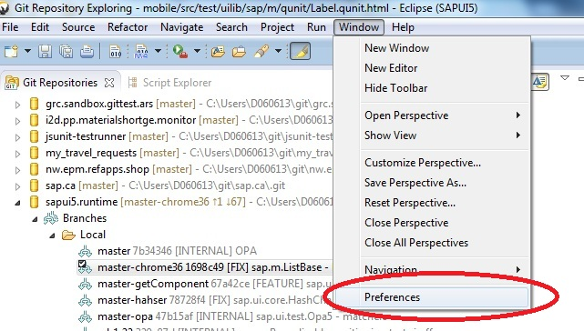
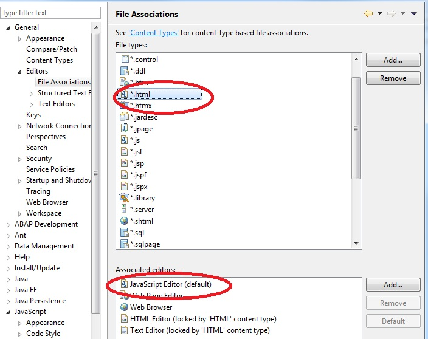
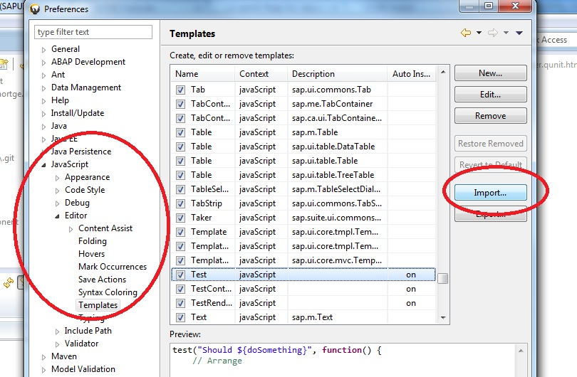

| loio |
| -----|
| a6b0657d226343da81ad96632cd1bd83 |

<div id="loio">

view on: [help.sap.com](https://help.sap.com/viewer/DRAFT/3237636b137e43519a20ad5513c49ccb/latest/en-US/a6b0657d226343da81ad96632cd1bd83.html) | [demo kit nightly build](https://openui5nightly.hana.ondemand.com/#/topic/a6b0657d226343da81ad96632cd1bd83) | [demo kit latest release](https://openui5.hana.ondemand.com/#/topic/a6b0657d226343da81ad96632cd1bd83)</div>
<!-- loioa6b0657d226343da81ad96632cd1bd83 -->

## How to Test OpenUI5 Controls with QUnit

Comprehensive overview of QUnit testing for controls.

***

### Dos and Don'ts

-   When writing QUnits, always keep your tests atomic.
-   Don't rely on the execution of previous tests.
-   Don't introduce globals, destroy controls after creating them.
-   Only test one single thing.
-   When writing a test, always make sure you break it first: don't rely on tests that have never failed!
-   Write human readable tests - use descriptive names for variables. Readability is more important than performance. You don't have to write a reuse for everything. It's ok to repeat yourself in unit tests if it helps readability.
-   Don't test too many internal aspects: try to test the control like an application or user will use it.
-   You have to find a balance between not stubbing / expecting too much of the internal aspects and not doing it at all. If you tightly couple your test to the implementation, maintenance will be a pain.
-   If your test is too long, you're squeezing too much stuff into one of your control's functions. Divide the complexity, then your test will be simpler and your productive code will be better.
-   Don't test general OpenUI5 functionality. Only test things actually done by your control \(see "What Should You Test?" below\).
-   Never write an `if` in a test. It is a sign that you're either not stubbing correctly or you're testing multiple things in one test.
-   Never use the `expect` QUnit statement. You should always write your test in a way that every assertion you set up will be hit 100%.
-   Whenever you encounter a Bug/Ticket, start by writing a QUnit that fails first, and *then* fix the code.
-   Write your tests as small as possible: don't add a statement that is not needed for the test, such as an ID in the control's constructor properties.
-   Use fake timers to avoid as many async tests as possible.
-   Don't test the exact same thing multiple times.
-   Use modules for grouping your tests: this will give you a better organizational test setup.
-   You may use modules for `beforeEach/afterEach`, but don't overuse this feature. If you have a longer module, you might not see what the test does because you don't know its setup.
-   It's sometimes better to write code multiple times.
-   Don't set up your system being tested in the `beforeEach/afterEach`. It is very rare that all tests in a module have the same constructor. Furthermore, using a global constructor object is dangerous.

If you stick to these rules, you will find it much easier to refactor/maintain your tests. Keeping the tests atomic will make debugging much easier, because you will hit your breakpoints for the code being tested only. If you write QUnits without keeping to these rules, you may well not notice anything bad to begin with, but you **will** eventually end up in the middle of a maintenance nightmare!

***

### Arrange Act Assert Pattern

Internally, we use three templates for testing. The one shown below is the general control template. If you are using Eclipse, a description of how you can import the templates is included at the end of this section.

Use the following pattern to structure your tests. If everyone sticks to this same pattern, you will be able to read your colleagues' tests very quickly:

```lang-js

QUnit.test("Should do Something", function (assert) { 
    // Arrange
    
    // System under Test
    var oMyControl = new nameSpace.myControl({
    });
    
    // Act
    
    // Assert

    // Cleanup
    oMyControl.destroy();
});
```

***

#### Arrange

In `Arrange`, you should set up the dependencies and options you need for your `System under Test`.

Examples:

-   The constructor object of your control
-   Sinon spies/stubs and mocks \(dependencies of your System under Test\)
-   Model

***

#### System under test

In `System under Test`, you should create your control and you should also render it if you want to test the rendering.

***

#### Act

Ideally, this part is only one single line of code executing the function you want to test.

***

#### Assert

This part may contain multiple statements of QUnit assertions, but ideally not too many in total.

Make sure that you also test negative paths, not only the expected ones.

***

#### Optional: Cleanup

Here you should destroy all the controls/models you created.

If you don't use Sinon sandboxes, revert all the spies/stubs/mocks.

***

### What Should You Test?

-   Test all the public functions you introduced.
-   Test all the overwritten getters and setters.
-   Test your control's events and how often they are called.
-   Test all possible user interactions \(tap, keyboard, focus\).
-   You could test how often your control gets rerendered when interacting with it, but only if you are worried that it might be rerenderd too often or not at all.
-   Test RTL if you have special things done in javascript.
-   Write some integration tests if you have a composite control \(don't cover 100% of your child controls - that's overkill and child controls will be hard to maintain\).
-   You may test default values of properties, since we cannot change them backwards afterwards and a test will recognize this.
-   Test how your control interacts with models \(OData + Json\).
-   Test the destruction of your control when working with composites, test if all dependencies/events are unbound on destruction.

***

### What Should You NOT Test?

-   Never test non-overwritten getters and setters \(these are tested in the core of the framework\).
-   Never test your complete CSS with computed styles: just check if the classes are set correctly. Focus on testing JavaScript.
-   Never test other generic framework functionality. Focus on your control.

***

### Rendering Tests

In the rendering tests part, you have to place your control in the DOM. The best place to put it is the `qunit-fixture` div, since its content gets deleted after every test.

Make sure you destroy your control, since OpenUI5 will keep a reference to it and may also rerender it.

It's crucial that you call `sap.ui.getCore().applyChanges()` after each time you have caused a rerendering.

The call to this function synchronizes the changes of your control with the DOM. If you do not make this call, the DOM will not be updated.

You can use the following template to make sure that you don't forget to destroy your control:

```lang-js
QUnit.test("Should do Something", function(assert) {
    // Arrange
        var oContructor = {
        
    };
    
    // System under Test
    var oMyControl = new nameSpace.myControl(oContructor);
    oMyControl.placeAt("qunit-fixture");
    sap.ui.getCore().applyChanges();

    // Act
    
    // Assert

    // Cleanup
    oMyControl.destroy();
});
```

***

### Pitfalls

***

#### Sinon fake timers

If you are using `sinon.qunit`, it will automatically use fake timers by itself. Fake timers will prevent any `setTimeout/setIntervall` function from being executed, unless you call `this.clock.tick(milliseconds)` in your test. This means that a Mock Server with auto-respond will not respond and OPA will not be able to wait for controls.

In addition, control events might be fired inside of a `setTimeout(, 0)`, so the event might not be triggered at all.

***

#### Testing OpenUI5 control events with Sinon

If you want to test OpenUI5 events, you can use spies to test how often they are called. If you try to test the parameters, however, you cannot do this with spies as OpenUI5 uses an eventPool that reuses the same object again. This means that after an event is set, all of the parameters will be deleted, Sinon will keep a reference to the object without properties.

The effect of this is that you cannot assert on them anymore. The workaround is to use a stub with a custom implementation that saves a copy of the parameters to your test function scope.

An example of this is shown in the cookbook below \(events\).

***

#### I've set a property on my control: Why aren't the changes in the DOM?

The most likely reason for this is that `sap.ui.getCore().applyChanges()` was not called. OpenUI5 does not render synchronously, but calling this function will render immediately.

***

### Importing the Templates

If you are using Eclipse, to import the templates start by calling up *Preferences* as shown below:

  

Make sure that you have added the JavaScript Editor to the *File Associations* under *General* \> *Editors* \> *File Associations*:

  

You can do this by choosing the *File Associations* link on the *Editors* start page, then selecting *\*.html* from the top list and adding *JavaScript Editor* as an associated editor:

  

While still in the *Preferences*, navigate to *JavaScript* \> *Editor* \> *Templates* and choose *Import...*:

  

After doing this, you test press * Ctrl Space * in your js/html files and start writing your test.

The following templates are available:

-   Test - for general classes
-   TestControl - for control tests without rendering
-   TestRendering - for control tests with rendering

