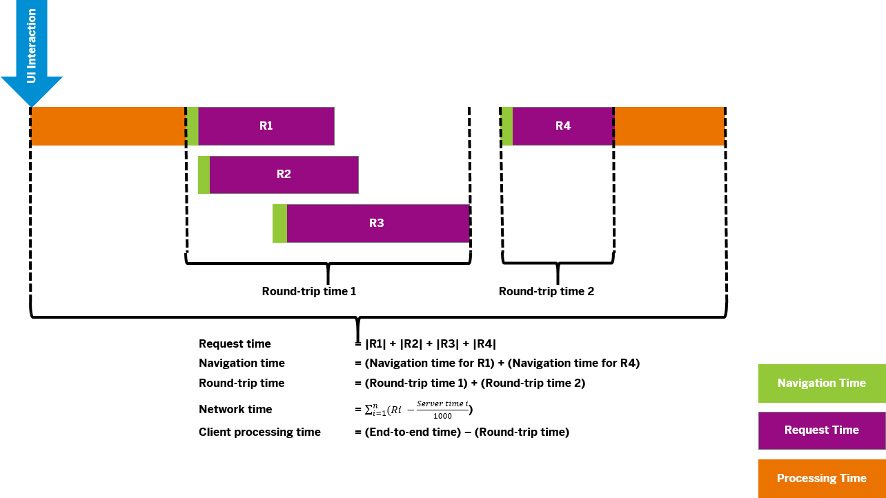

<!-- loiob2825eabd7bb43d79b475fee4194c609 -->

| loio |
| -----|
| b2825eabd7bb43d79b475fee4194c609 |

<div id="loio">

view on: [demo kit nightly build](https://openui5nightly.hana.ondemand.com/#/topic/b2825eabd7bb43d79b475fee4194c609) | [demo kit latest release](https://openui5.hana.ondemand.com/#/topic/b2825eabd7bb43d79b475fee4194c609)</div>

## Interaction Tracking for Performance Measurement

You can identify performance issues in your application by tracking the interaction that is performed on the UI.

Interaction in this context means a closed step in a sequence of actions that a user performs on the UI, for example, everything that happens between two clicks on two different buttons.

To **start** interaction tracking, use `Interaction.setActive(true)` from module **sap/ui/performance/trace/Interaction**. To map the interaction data to the data of **sap/ui/performance/Measurement**, you have to explicitly set `sap-ui-measure=true`.

To **retrieve** the result of the interaction measurement, use `Interaction.getAll()` from module **sap/ui/performance/trace/Interaction**. This returns an array of all interactions that occurred and their measurement.

You can use `Interaction.filter` from module **sap/ui/performance/trace/Interaction** to filter the interaction measurements according to a filter function \(`fnFilter`\).

***

### Example of an Interaction Measurement

``` js
InteractionMeasurement = {
    event: "click",             // event which triggered interaction
    trigger: "Button1",         // control which triggered interaction
    component: "my.Component",  // component or app identifier
    start : 0,                  // interaction start
    end: 0,                     // interaction end
    navigation: 0,              // sum over all navigation times on the critical path
    roundtrip: 0,               // time from first request sent to last received response end
    processing: 0,              // client processing time
    duration: 0,                // interaction duration
    requests: [],               // Performance API requests during interaction
    measurements: [],           // sap/ui/performance/Measurement measurements
    sapStatistics: [],          // SAP Statistics for OData
    requestTime: 0,             // sum over all requests in the interaction
    networkTime: 0,             // request time minus server time from the header
    bytesSent: 0,               // sum over all requests bytes
    bytesReceived: 0,           // sum over all response bytes
    requestCompression: false,  // true if all responses have been sent gzipped
    busyIndication: 0           // summed GlobalBusyIndicator duration during this interaction
}
```

***

### Properties of Interaction Measurements

Properties of Interaction Measurements<a name="loiob2825eabd7bb43d79b475fee4194c609__table_wx1_pdf_mv"/>

 > **Warning:** The below table contains complex elements that cannot not be displayed within a simple markdown table. It has been automatically converted to an HTML table. It's design may vary from the source page!

<table>
	<thead>
		<tr>
			<th>Property</th>
			<th>Type</th>
			<th>Description</th>
		</tr>
	</thead>
	<tbody>
		<tr>
			<td> `event` </td>
			<td> `String` </td>
			<td> Event type which triggered the interaction. Allowed types are:
 -   `mousedown`

 -   `mouseup`

 -   `click`

 -   `keydown`

 -   `keyup`

 -   `keypress`

 -   `touchstart`

 -   `touchend`

 -   `tap`

 -   `mousewheel`

 -   `scroll`
			</td>
		</tr>
		<tr>
			<td> `trigger` </td>
			<td> `String` </td>
			<td>ID of the element that triggered the action</td>
		</tr>
		<tr>
			<td> `component` </td>
			<td> `String` </td>
			<td>ID of the app or name of the Component that contains the triggering element</td>
		</tr>
		<tr>
			<td> `start` </td>
			<td> `Number` </td>
			<td>Time stamp when interaction was started \(in ms\)</td>
		</tr>
		<tr>
			<td> `end` </td>
			<td> `Number` </td>
			<td> Time stamp when interaction has been finalized \(in ms\)
 > Note:
 > This is not always the start time plus the duration. The duration is determined depending on the heuristic determination of the processing time.
			</td>
		</tr>
		<tr>
			<td> `navigation` </td>
			<td> `Number` </td>
			<td>Navigation time for all requests, calculated as difference from `startTime` to `connectEnd` of a `PerformanceTiming` \(in ms\) Requests that are started while another request is already in progress are ignored \(see figure below\).</td>
		</tr>
		<tr>
			<td> `roundtrip` </td>
			<td> `Number` </td>
			<td>Roundtrip time for a request, calculated as difference from `requestStart` to `responseEnd` of a `PerformanceTiming` \(in ms\)</td>
		</tr>
		<tr>
			<td> `processing` </td>
			<td> `Number` </td>
			<td>JavaScript processing time of an interaction. This is the time consumed when no requests are active. Although we also have JavaScript being processed while asynchronous requests are active, we only consider those to be relevant \(in ms\)</td>
		</tr>
		<tr>
			<td> `duration` </td>
			<td> `Number` </td>
			<td>If a processing time could be determined duration is navigation plus roundtrip plus processing time. Otherwise it is navigation time plus roundtrip time, or end time minutes start time if network requests last longer than the actual interaction \(in ms\)</td>
		</tr>
		<tr>
			<td> `requests` </td>
			<td> `PerformanceTiming[]` </td>
			<td>All requests that occurred during the interaction, taken from the **NavigationTiming** API</td>
		</tr>
		<tr>
			<td> `measurements` </td>
			<td> `Measurement[]` </td>
			<td>Performance measurements \(see [Performance Measurement Using sap/ui/performance/Measurement Module](Performance_Measurement_Using_sapuiperformanceMeasurement_Module_78880c0.md)\)</td>
		</tr>
		<tr>
			<td> `sapStatistics` </td>
			<td> `Object[]` </td>
			<td>Map of request URL to corresponding `sap-statistics` header as String \( format: `{ url: "https://somehost.com/sap/data...", statistics: "total=167,fw=167,app=0,gwtotal=167,gwhub=160,gwrfcoh=0,gwbe=7,gwapp=0,gwnongw=0" }`\)</td>
		</tr>
		<tr>
			<td> `requestTime` </td>
			<td> `Number` </td>
			<td>Sum over all request durations of this interaction, from `startTime` to `responseEnd` \(in ms\)</td>
		</tr>
		<tr>
			<td> `networkTime` </td>
			<td> `Number` </td>
			<td>Average latency of the requests that occurred during the interaction, calculated using the `sap-perf-fesrec` header that is sent \(if available\) by the back end with each response \(in ms\)</td>
		</tr>
		<tr>
			<td> `bytesSent` </td>
			<td> `Number` </td>
			<td>Sum over all bytes sent with requests \(content plus headers\)</td>
		</tr>
		<tr>
			<td> `bytesReceived` </td>
			<td> `Number` </td>
			<td>Sum over all bytes received with responses \(content plus headers\)</td>
		</tr>
		<tr>
			<td> `requestCompression` </td>
			<td> `Boolean` </td>
			<td>Indicates if all requests during an interaction have been received in GNU zip format \("gzipped"\)</td>
		</tr>
		<tr>
			<td> `busyDuration` </td>
			<td> `Number` </td>
			<td>Time how long a `GlobalBusyIndicator` was rendered and hence blocking the UI during an interaction</td>
		</tr>
	</tbody>
</table>

***

### Calculation of Times



**Related information**  


[API Reference: `jQuery.sap.measure`](https://openui5.hana.ondemand.com/#docs/api/symbols/jQuery.sap.measure)

[Performance Measurement Using sap/ui/performance/Measurement Module](Performance_Measurement_Using_sapuiperformanceMeasurement_Module_78880c0.md)

[**NavigationTiming** API on `https://developer.mozilla.org`](https://developer.mozilla.org/en/docs/Web/API/Navigation_timing_API)

[Navigation Timing on `https://www.w3.org/`](https://www.w3.org/TR/2012/REC-navigation-timing-20121217)

