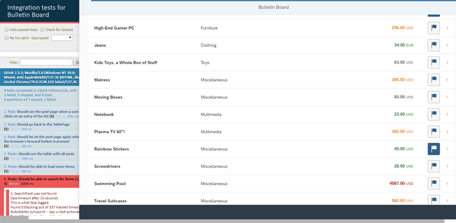

| loio |
| -----|
| 92959b10ecf14582b65eaadb40571156 |

<div id="loio">

view on: [help.sap.com](https://help.sap.com/viewer/DRAFT/3237636b137e43519a20ad5513c49ccb/latest/en-US/92959b10ecf14582b65eaadb40571156.html) | [demo kit nightly build](https://openui5nightly.hana.ondemand.com/#/topic/92959b10ecf14582b65eaadb40571156) | [demo kit latest release](https://openui5.hana.ondemand.com/#/topic/92959b10ecf14582b65eaadb40571156)</div>
<!-- loio92959b10ecf14582b65eaadb40571156 -->

## Step 11: Testing User Input

In this step, we will write a test that simulates a user search. We will enter the search string into the search field and check if the correct results are shown in worklist table.

***

### Preview

   
  
Testing user input in a search field<a name="loio92959b10ecf14582b65eaadb40571156__fig_k3l_yjj_sx"/>

  

***

### Coding

You can view and download all files in the Demo Kit at [Testing - Step 11](https://openui5.hana.ondemand.com/explored.html#/sample/sap.m.tutorial.testing.11/preview).

***

### test/integration/WorklistJourney.js

``` js
sap.ui.define([
	"sap/ui/test/opaQunit",
	"./pages/Worklist"
], function (opaTest) {
	"use strict";

	QUnit.module("Posts");

	opaTest("Should see the table with all posts", function (Given, When, Then) {
		// Arrangements
		Given.iStartMyApp();

		// Assertions
		Then.onTheWorklistPage.theTableShouldHavePagination().
			and.theTitleShouldDisplayTheTotalAmountOfItems();
	});

	opaTest("Should be able to load more items", function (Given, When, Then) {
		//Actions
		When.onTheWorklistPage.iPressOnMoreData();

		// Assertions
		Then.onTheWorklistPage.theTableShouldHaveAllEntries();
	});
	*HIGHLIGHT START*opaTest("Should be able to search for items", function (Given, When, Then) {
		//Actions
		When.onTheWorklistPage.iSearchFor("Bear");

		// Assertions
		Then.onTheWorklistPage.theTableHasOneItem();

		// Cleanup
		Then.iTeardownMyApp();
	});
*HIGHLIGHT END*
	}
);
```

In this example, we extend the `WorklistJourney.js` file with a new test `"Should be able to enter text into the search field"`. The action within this test simulates a user entering text into a search field, so we pass a search string `"Bear"` to this action. It is important to move the `Teardown` step to the last test, otherwise our app would be destroyed and the test would not be able to find the *Statistics* tab.

Delete `.and.iTeardownMyApp();` from the previous test in the file and add the new test case.

***

### test/integration/pages/Worklist.js

``` js
sap.ui.require([
		'sap/ui/test/Opa5',
		'sap/ui/test/matchers/AggregationLengthEquals',
		'sap/ui/test/matchers/I18NText',
		'sap/ui/test/matchers/BindingPath',
		'sap/ui/demo/bulletinboard/test/integration/pages/Common',
		'sap/ui/test/actions/Press'*HIGHLIGHT START*,
		'sap/ui/test/actions/EnterText'*HIGHLIGHT END*
	],
	function (Opa5,
			  AggregationLengthEquals,
			  I18NText,
			  BindingPath,
			  Common,
			  Press*HIGHLIGHT START*,
			  EnterText*HIGHLIGHT END*) {
		"use strict";

		var sViewName = "Worklist",
			sTableId = "table";

		Opa5.createPageObjects({
			onTheWorklistPage: {
				baseClass: Common,
				actions: {
...
					}*HIGHLIGHT START*,
					
					iSearchFor: function (sSearchString) {
						return this.waitFor({
							id: "searchField",
							viewName: sViewName,
							actions: new EnterText({
								text: sSearchString
							}),
							errorMessage: "SearchField was not found."
						});
					}
*HIGHLIGHT END*
				},
				assertions: {
					*HIGHLIGHT START*theTableHasOneItem: function () {
						return this.waitFor({
							id: sTableId,
							viewName: sViewName,
							matchers: new AggregationLengthEquals({
								name: "items",
								length: 1
							}),
							success: function () {
								Opa5.assert.ok(true, "The table contains one corresponding entry");
							},
							errorMessage: "The table does not contain one item."
						});
					},*HIGHLIGHT END*
...
```

For the new test case we add an action `iEnterSearchStringIntoSearchField` and a new assertion `theTableShouldHaveCorrespondingEntries`.

In `iEnterSearchStringIntoSearchField`, we use the `EnterText` action and load the dependency `sap/ui/test/actions/EnterText`.

We define a `waitFor` statement with the current view and with the ID of our `SearchField`, which is stored as an internal variable. This is done in the same way as in the `iPressOnMoreData` action that we implemented in our first OPA test. But now we don't use the `EnterText` action. As soon as the `SearchField` is visible on the screen and can be interacted with, the `EnterText` action is invoked. If is is not invoked, an error message is displayed and the test fails.

The `assert` part is implemented in the same way as in our first OPA test. Again, we use the matchers to check the state. Here we check the number of items in the table resulting from the simulated search. According to our mock data, there should be only one item visible.

***

### Conventions

Actions in OPA never contain a QUnit assertion.

**Related information**  


[API Reference: `sap.ui.test.actions.EnterText`](https://openui5.hana.ondemand.com/#docs/api/symbols/sap.ui.test.actions.EnterText.html)

