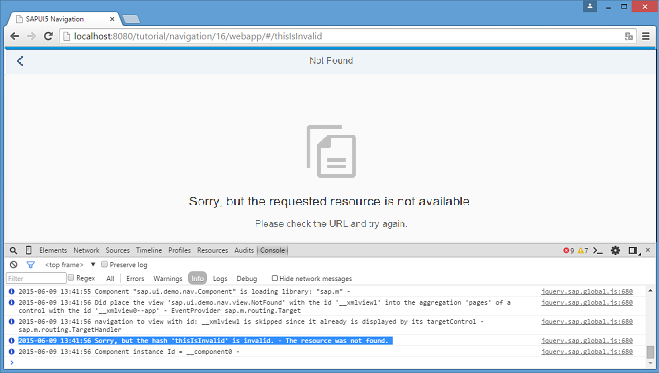

| loio |
| -----|
| a7932a791adc4a58ae4693400801ea5f |

<div id="loio">

view on: [help.sap.com](https://help.sap.com/viewer/DRAFT/3237636b137e43519a20ad5513c49ccb/latest/en-US/a7932a791adc4a58ae4693400801ea5f.html) | [demo kit nightly build](https://openui5nightly.hana.ondemand.com/#/topic/a7932a791adc4a58ae4693400801ea5f) | [demo kit latest release](https://openui5.hana.ondemand.com/#/topic/a7932a791adc4a58ae4693400801ea5f)</div>
<!-- loioa7932a791adc4a58ae4693400801ea5f -->

## Step 16: Handle Invalid Hashes by Listening to Bypassed Events

So far we have created many useful routes in our app. In the very early steps we have also made sure that a *Not Found* page is displayed in case the app was called with an invalid hash. Now, we proceed further and track invalid hashes to be able to detect and correct any invalid links or add new URL patterns that are often requested but not found. Therefore, we simply listen to the bypassed events

***

### Preview

   
  
Console output for invalid hashes when listening to bypassed events<a name="loioa7932a791adc4a58ae4693400801ea5f__fig_r1j_pst_mr"/>

  

***

### Coding

You can view and download all files in the *Samples* in the Demo Kit at [Routing and Navigation - Step 16](https://openui5.hana.ondemand.com/explored.html#/sample/sap.ui.core.tutorial.navigation.16/preview).

***

### webapp/controller/App.controller.js

``` js
sap.ui.define([
	"sap/ui/demo/nav/controller/BaseController"
], function (BaseController) {
	"use strict";

	return BaseController.extend("sap.ui.demo.nav.controller.App", {

		onInit: function () {
			*HIGHLIGHT START*// This is ONLY for being used within the tutorial.
			// The default log level of the current running environment may be higher than INFO,
			// in order to see the debug info in the console, the log level needs to be explicitly
			// set to INFO here.
			// But for application development, the log level doesn't need to be set again in the code.
			Log.setLevel(Log.Level.INFO);

			var oRouter = this.getRouter();

			oRouter.attachBypassed(function (oEvent) {
				var sHash = oEvent.getParameter("hash");
				// do something here, i.e. send logging data to the backend for analysis
				// telling what resource the user tried to access...
				Log.info("Sorry, but the hash '" + sHash + "' is invalid.", "The resource was not found.");
			});*HIGHLIGHT END*
		}

	});

});
```

All we need to do is listen to the bypassed event on the router. If the bypassed event is triggered, we simply get the current hash and log a message. In an actual app this is probably the right place to add some application analysis features, i.e. sending analytical logs to the back end for later evaluation and processing. This could be used to improve the app, for example, to find out why the user called the app with an invalid hash.

> Note:
> We have chosen to place this piece of code into the `App` controller because this is a global feature of the app. However, you could also place it anywhere else, for example in the `NotFound` controller file or in a helper module related to analysis.
> 
> 

Now try to access `webapp/index.html#/thisIsInvalid` while you have your browser console open. As you can see, there is a message that issues a faulty hash. Furthermore, our `NotFound` page is displayed.

**Related information**  


[API Reference: `sap.m.routing.Router`](https://openui5.hana.ondemand.com/#docs/api/symbols/sap.m.routing.Router.html)

