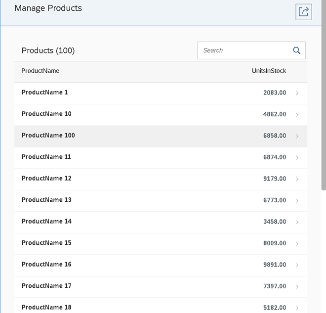
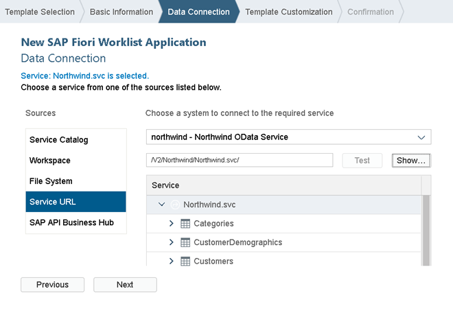
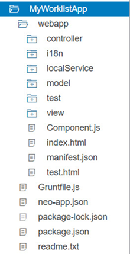

| loio |
| -----|
| 0c5dc937271f4f56b5e7d54676199860 |

view on: [help.sap.com](https://help.sap.com/viewer/DRAFT/3237636b137e43519a20ad5513c49ccb/latest/en-US/0c5dc937271f4f56b5e7d54676199860.html) | [demo kit nightly build](https://openui5nightly.hana.ondemand.com/#/topic/0c5dc937271f4f56b5e7d54676199860) | [demo kit latest release](https://openui5.hana.ondemand.com/#/topic/0c5dc937271f4f56b5e7d54676199860)

<!-- loio0c5dc937271f4f56b5e7d54676199860 -->

## Step 1 \(Option 1\): Creating the Initial App with an App Template in SAP Web IDE

This first step is only relevant if you decided to use the SAP Web IDE. In this step, we will set up the worklist app using a template and configure the service to display products in the app. The template includes generic app functionality and tests that can be easily extended with custom functionality for our use case.

***

### Prerequisites

Set up your SAP Web IDE and define a destination to the Northwind OData service as described under [App Development Using SAP Web IDE](App_Development_Using_SAP_Web_IDE_13ced94.md).

***

### Preview

   
  
The worklist app<a name="loio0c5dc937271f4f56b5e7d54676199860__fig_ohj_bqh_b5"/>

  

***

### Create the Initial App Using the Template Wizard

1.  Launch SAP Web IDE.

2.  Choose *File* \> *New* \> *Project from Template*

3.  Select the *SAP Fiori Worklist Application* template, and choose the latest SAPUI5 version from the *SAPUI5 Version* dropdown box. Choose *Next*.

4.  On the *Basic Information* screen, enter `MyWorklistApp` as project name. Enter the following data:

     *App Descriptor Data*<a name="loio0c5dc937271f4f56b5e7d54676199860__table_kqz_pc1_tdb"/>

    |Field|Value|Description|
    |-----|-----|-----------|
    | *Title* | `Manage Products` |Title of the app, which will be displayed as header.|
    | *Namespace* | `mycompany.myapp` |The application namespace is a unique identifier for your application resources.|
    | *Description* | `My Worklist App` |Short description of your app.|

    Choose *Next*.

5.  On the *Data Connection* screen, select *Service URL* in the *Sources* area.

    Choose *northwind - Northwind OData Service* and enter the URL `/V2/Northwind/Northwind.svc/`.

    > Note:
    > If you cannot find the Northwind service, create the destination as described under [Create a Northwind Destination](Create_a_Northwind_Destination_3a16c7a.md).
    > 
    > 

    Validate the URL by choosing *Test* next to the URL. You should now see the service entities as displayed in the following screenshot:

    

    > Note:
    > At runtime, the relative URL `/V2/Northwind/Northwind.svc/` is prefixed with `/destinations/northwind`. As a result, all our Northwind OData requests will be proxied via the *Northwind OData Service* destination that is defined in the SAP Cloud Platform Cockpit. The destination contains the URL to the resource `http://services.odata.org` and has the proxy type *Internet*. From this configuration the proxy knows where the requests are directed.
    > 
    > 

    Choose *Next*.

6.  On the *Template Customization* screen, select the following data:

     *Application Scenario*<a name="loio0c5dc937271f4f56b5e7d54676199860__table_dhj_y21_tdb"/>

    |Field|Value|Description|
    |-----|-----|-----------|
    | *App Type* | `Standalone App` |We create a standalone app that can be run without SAP Fiori launchpad \(FLP\). If you choose to build an *SAP Fiori Launchpad Component*, you automatically get test HTML files with the FLP Sandbox, and the app automatically includes additional features like *Save as Tile*.|

     *Data Binding - Object*<a name="loio0c5dc937271f4f56b5e7d54676199860__table_z25_tyh_b5"/>

    |Field|Value|Description|
    |-----|-----|-----------|
    | *Object Collection* | `Products` |This is the main entity set that will be displayed in the app. Some of the other fields below are automatically selected depending on this field.|
    | *Object Collection ID* | `ProductID` |The unique key that is used to identify the object collection.|
    | *Object Title* | `ProductName` |The display name of the main entity.|
    | *Object Numeric Attribute* | `UnitsInStock` |The number displayed next to the product name. In this scenario we pick the `UnitsInStock`. This represents the stock quantity of the product.|

7.  Choose *Next* and *Finish*

    A new folder `MyWorklistApp` is now available in your local workspace. It contains the following files and folders of the initial app:

       
      
    Folder structure of the initial project<a name="loio0c5dc937271f4f56b5e7d54676199860__fig_j5n_pzh_b5"/>

      

    > Note:
    > The auto-generated files `Gruntfile.js`, `package-lock.json`, and `package.json` are only necessary for working with SAP Web IDE or a local IDE. They are not included in case you download the example code from the *Samples*.
    > 
    > These three files will not be changed throughout this tutorial, so we will ignore them in the following steps.
    > 
    > 

8.  Run the app.

    There are several HTML files available in the `webapp/test` folder, which enable you to run the app with a Mock Server. You can also use them to run unit tests and OPA tests.

    > Note:
    > The template comes with two run configurations for SAP Web IDE: You can either run the app with data from a real back end service \(*Run webapp/index.html*\) or with local mock data \(*Run webapp/test/mockServer.html \(Mock Server\)*\).
    > 
    > We choose the mock server option, because then the app will still be able to run even if the back end is unavailable or the service is not implemented yet. We could even configure a delay to make local testing more realistic.
    > 
    > 

    You should see the screen, which contains generated mock data.

From now on you can quickly run the app by selecting the root folder `MyWorklistApp` of your project in SAP Web IDE and pressing the *Run* button. The system will automatically use the option from the *Run* menu that you chose last \(in this case, the *Run with MockServer* option\).

> Note:
> The texts in the `i18n.properties` file are automatically generated based on the template Customizing \(OData entity set, entities, properties, and texts\). The result can be incorrect texts like "Enter an <Products\> name or a part of it." You should therefore revise the generated texts in the `i18n.properties` file.
> 
> 

**Related information**  

[App Development Using SAP Web IDE](App_Development_Using_SAP_Web_IDE_13ced94.md)

