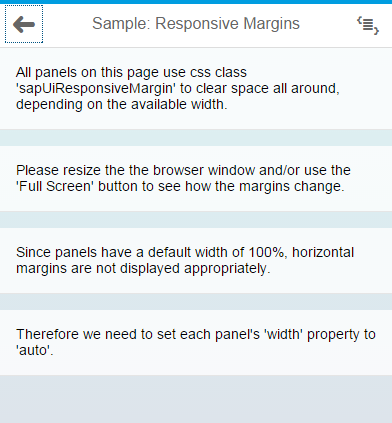
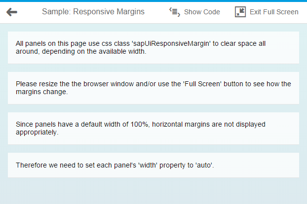
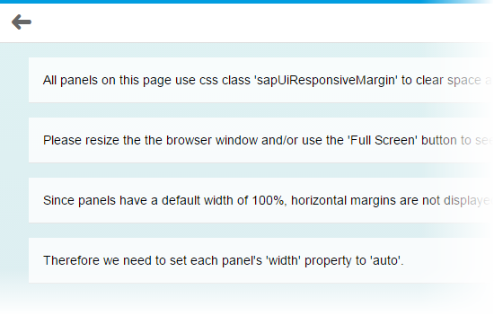

<!-- loio777168ffe8324873973151dae2356d1c -->

| loio |
| -----|
| 777168ffe8324873973151dae2356d1c |

<div id="loio">

view on: [demo kit nightly build](https://openui5nightly.hana.ondemand.com/#/topic/777168ffe8324873973151dae2356d1c) | [demo kit latest release](https://openui5.hana.ondemand.com/#/topic/777168ffe8324873973151dae2356d1c)</div>

## Using Predefined CSS Margin Classes

OpenUI5 gives you the option of adding spacing in between controls by adding a margin. A margin clears an area around its respective control, outside of its border.

Unlike paddings, margins are transparent, are not part of the control's clickable area, and they collapse with adjacent margins, meaning that they do not add to each other. For instance, if you have two 32px margins next to each other, the result is that only one 32px margin is displayed, not 64px of space.

All margins predefined in OpenUI5 support right-to-left \(RTL\) languages: when you add a margin to the left, we make sure that it's displayed on the right if your user has chosen an RTL language such as Hebrew or Arabic. For our CSS classes, we offer four standard sizes, namely tiny \(0.5rem or 8px\), small \(1rem or 16px\), medium \(2rem or 32px\) and large \(3rem or 48px\).

There are four types of margins available:

-   Full margins, which completely surround your control
-   Single-sided margins
-   Two-sided margins
-   Responsive margins, which adapt to the available screen width

***

### Full Margins

If you would like to clear an area **all around your control**, use one of the following margin classes:

-   `sapUiTinyMargin`

-   `sapUiSmallMargin`

-   `sapUiMediumMargin`

-   `sapUiLargeMargin`


***

### Single-Sided Margins

For single-sided margins, choose a size \(`Tiny`, `Small`, `Medium`, or `Large`, which stands for 8, 16, 32 or 48px respectively\) and a direction \(`Begin`, `End`, `Top`, or `Bottom`, where `Begin` is left and `End` is right and vice versa in RTL mode\). For example, if you need to clear a 32px space to the left of your control \(or to the right in RTL mode\), you would add the class `sapUiMediumMarginBegin`. You can also add several classes at once, as long as they point to different directions. For example, you would add classes `sapUiLargeMarginEnd` and `sapUiLargeMarginBottom` to clear a 48px space to the bottom and to the right of a control \(or to the left in RTL mode\).

Here are the classes we provide for single-sided margins:

| `sapUiTinyMarginTop` `sapUiTinyMarginBottom` `sapUiTinyMarginBegin` `sapUiTinyMarginEnd` | `sapUiSmallMarginTop` `sapUiSmallMarginBottom` `sapUiSmallMarginBegin` `sapUiSmallMarginEnd` | `sapUiMediumMarginTop` `sapUiMediumMarginBottom` `sapUiMediumMarginBegin` `sapUiMediumMarginEnd` | `sapUiLargeMarginTop` `sapUiLargeMarginBottom` `sapUiLargeMarginBegin` `sapUiLargeMarginEnd` |

***

### Two-Sided Margins

If you’d like to clear the space to the left and right or top and bottom of your control, we've provided several two-sided margin classes for you to use. Again, just choose the size and orientation that you need \(`BeginEnd`, `TopBottom`\). For example, if you need to clear a 32px space both to the left and right of a control, you would add the class `sapUiMediumMarginBeginEnd`. Here are the classes that are available:

| `sapUiTinyMarginBeginEnd` `sapUiTinyMarginTopBottom` | `sapUiSmallMarginBeginEnd` `sapUiSmallMarginTopBottom` | `sapUiMediumMarginBeginEnd` `sapUiMediumMarginTopBottom` | `sapUiLargeMarginBeginEnd` `sapUiLargeMarginTopBottom` |

We've also provided a set of negative margin classes that add a two-sided \(`BeginEnd`\) negative margin of an element. The negative margins are useful for aligning elements with built-in paddings.

| `sapUiTinyNegativeMarginBeginEnd` | `sapUiSmallNegativeMarginBeginEnd` | `sapUiMediumNegativeMarginBeginEnd` | `sapUiLargeNegativeMarginBeginEnd` |

***

### Responsive Margins

If your application is supposed to run on smartphone, tablet and desktop, it can be useful to choose your margins depending on the screen width that is available. OpenUI5 now comes with CSS class `sapUiResponsiveMargin`, which does just that. It works with media queries to determine the available screen width and adapts its margin as follows:

 > **Warning:** The below table contains complex elements that cannot not be displayed within a simple markdown table. It has been automatically converted to an HTML table. It's design may vary from the source page!

<table>
	<thead>
		<tr>
			<th>Screen Width</th>
			<th>Example</th>
		</tr>
	</thead>
	<tbody>
		<tr>
			<td>Screen width less than 600px \(smartphones\): For devices such as these, `sapUiResponsiveMargin` provides a 16px \(1rem\) bottom margin to your control. Each of the panels shown in the screenshot is using `sapUiResponsiveMargin`. As a result, they're all clearing the same 16px area of space below them.</td>
			<td>  

 
			</td>
		</tr>
		<tr>
			<td>Between 600px and 1023px \(tablets and small desktops\): For these, `sapUiResponsiveMargin` provides a 16px \(1rem\) margin all around your control, as you can see in the screenshot.</td>
			<td>  

 
			</td>
		</tr>
		<tr>
			<td>Larger than 1023px \(large desktops\): For these, `sapUiResponsiveMargin` provides 16px \(1 rem\) top and bottom margin as well as a 32px \(2 rem\) left and right margin, as shown in the screenshot.</td>
			<td>  

 
			</td>
		</tr>
	</tbody>
</table>

The following exceptions to these rules exist:

-   When your `sapUiResponsiveMargin` control is placed within an `sap.m.SplitApp` master view, it's always provided with a 16px bottom margin and nothing else. Here, the thresholds mentioned previously do not affect your control.
-   Within a `SplitApp`’s detail view, there's always a 16px margin all around your `sapUiResponsiveMargin` control, regardless of the available screen width. Usually, the `SplitApp` is responsive as well, though. If it hides its master view because the available screen width isn't sufficient, or if it’s running in ‘HideMode’, your control also ignores the fact that it's placed into a `SplitApp`’s detail view and it becomes responsive again.

***

### Controls with 100% Width

When applying classes with horizontal margins to a control, such as `sapUiSmallMargin` or `sapUiSmallMarginBegin`, for example, make sure that your control doesn’t have a 100% width. If your control has a `width` property \(which most controls have\), set the width value to `auto`, for example:

```
<Panel *HIGHLIGHT START*width="auto"*HIGHLIGHT END* class="sapUiLargeMarginBegin
      sapUiLargeMarginBottom">
```

If your control does **not** have a `width` property but still has a default width of 100%, you can add our CSS class `sapUiForceWidthAuto` to your control, which ensures that the control’s default width is overwritten with the value `auto`. An example for such a control is `sap.m.IconTabBar`.

***

### Adding Margin Classes to Your Code

To apply the classes described here in your code, simply add a `class` attribute and the margin class to the respective control tag in your declarative xml views. If you need to add several classes at once \(which can be the case if you’re using single-sided margins\), separate them by a space. Here’s a sample snippet containing a panel and an `IconTabBar`:

``` xml

<mvc:View
      height="100%"
      controllerName="sap.m.sample.StandardMarginsEnforceWidthAuto.Page"
      xmlns:mvc="sap.ui.core.mvc"
      xmlns="sap.m">
      .
      .
      .
      <Panel width="auto" class="sapUiLargeMarginBegin sapUiLargeMarginBottom">
          <content>
                  
          </content>
      </Panel>
<IconTabBar
  expanded="{device>/isNoPhone}"
  class="sapUiForceWidthAuto sapUiMediumMarginBeginEnd">
  <items>
		.
		.
		.
  </items>
</IconTabBar>
      .
      .
</mvc:View>
```

If you would like to add margins to javascript code, use the control’s `addStyleClass` method. For example: `myPanel.addStyleClass(‘sapUiLargeMargin’)`. Again, if you need to add several classes at once, you can do so by separating them by a space. Make sure that you set the panel’s width to `auto` as shown here: `myPanel.setWidth(‘auto’)`.

***

### Removing Margins

If a control comes with a margin that you don’t want for some particular reason, you can use one of our convenience classes to remove it. You can either use `sapUiNoMargin` to remove the margins all around your control, or you can choose one or more classes from the following list to remove a margin in one or more particular directions:

-   `sapUiNoMarginTop`

-   `sapUiNoMarginBottom`

-   `sapUiNoMarginBegin`

-   `sapUiNoMarginEnd`


***

### Sample

For a detailed example of how our predefined margin classes work, see the [Samples](https://openui5.hana.ondemand.com/#/entity/sap.ui.core.StandardMargins).

